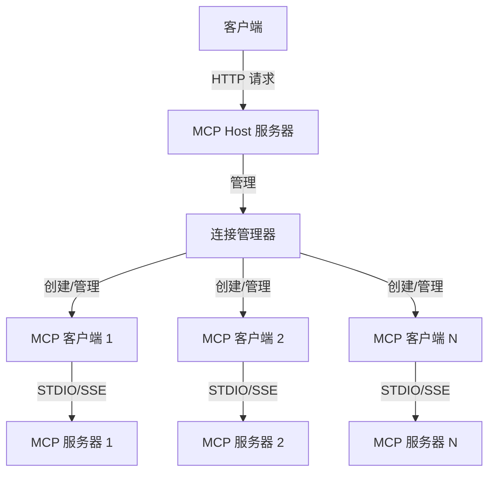

# MCP-Host-Node

> MCP-Host-Node 是一个基于 Node.js 的 Model Context Protocol (MCP) 主机应用程序，用于连接和管理多个 MCP 服务器。该项目提供了一个统一的接口，允许客户端通过 HTTP API 与多个 MCP 服务器进行交互，获取工具列表、资源列表，以及调用特定服务器上的工具。

## 架构图



## 主要功能
- 支持同时连接多个 MCP 服务器
- 支持 STDIO 和 SSE 两种传输方式
- 提供统一的 HTTP API 接口，用于：
    - 获取所有服务器的工具列表
    - 调用特定服务器上的工具
    - 获取所有服务器的资源列表


## 项目结构
```bash
mcp-host-node/
├── src/                      # 源代码目录
│   ├── main.ts               # 主入口文件
│   ├── host.ts               # MCP 连接管理器
│   ├── client.ts             # MCP 客户端实现
│   ├── server.ts             # HTTP 服务器实现
│   ├── types.ts              # 类型定义
│   └── utils.ts              # 工具函数
├── dist/                     # 构建输出目录
```

## 使用
### 安装依赖
- `npm install`

### 开发模式
- `npm run dev`

### 构建，生产环境
- `npm run build`
- 生产环境使用：`production_node.exe dist/index.esm.js`


## 注意事项
- 服务器默认运行在 36003 端口
- 确保配置文件中的服务器信息正确
- 对于 STDIO 传输方式，需要确保命令可执行
    - 使用 `npx` 指令时默认查找当前 Nodejs 安装目录下的 `npx` 文件
- 对于 SSE 传输方式，需要确保 URL 可访问

## API 使用示例
### 获取所有工具列表

```bash
GET http://localhost:36003/api/tools
```

#### 响应
```json
{
  "code": 0,
  "data": [
    {
      "server_name": "服务器1",
      "tools": [
        {
          "name": "工具名称",
          "description": "工具描述",
          "inputSchema": { ... }
        }
      ]
    }
  ]
}
```

### 调用工具

```bash
POST http://localhost:36003/api/tools/toolCall
Content-Type: application/json

{
  "server_name": "服务器名称",
  "tool_name": "工具名称",
  "tool_args": { ... }
}
```

#### 响应

```json
{
  "code": 0,
  "data": {
    "result": "工具执行结果"
  }
}
```