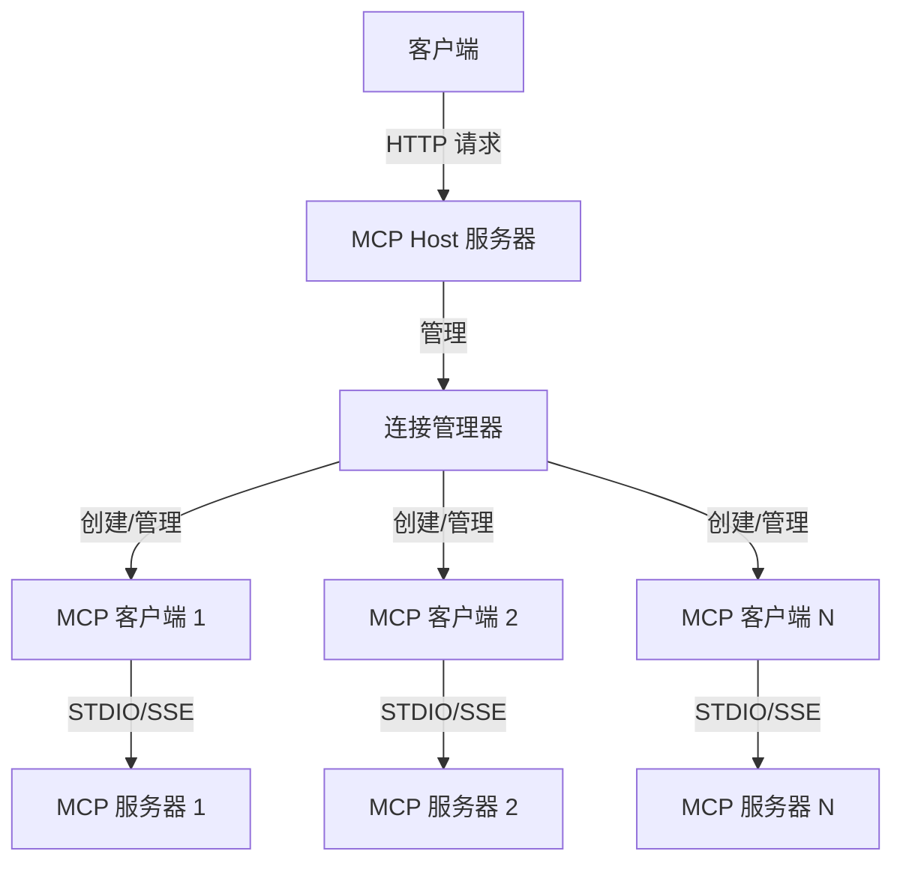

<p align="center">
  中文 | <a href="./README.EN.md">EN</a>
</p>

# mcp-host-use

### mcp-host-use 是一个基于 Node.js 的 Model Context Protocol (MCP) 主机应用程序，用于连接和管理多个 MCP 服务器。Host 提供了统一的接口，允许客户端通过 HTTP API 与多个 MCP 服务器进行交互，访问及调用工具(或资源)。你可以使用它快速测试及运行你的 MCP Servers。

## 架构图



## 主要功能
- 支持同时连接多个 MCP 服务器, 通过 `json` 文件管理多个 MCP 服务器
- 支持 STDIO 和 SSE 两种传输方式
- 提供统一的 HTTP API 接口，用于：
    - 获取所有服务器的工具列表
    - 调用特定服务器上的工具
    - 获取所有服务器的资源列表
    - 获取特定服务器上的资源
    - 触发 Host 主动更新 Server 连接


## 项目结构
```bash
mcp-host-use/
├── src/                      # 源代码目录
│   ├── main.ts               # 主入口文件
│   ├── host.ts               # MCP 连接管理器
│   ├── client.ts             # MCP 客户端实现
│   ├── server.ts             # HTTP 服务器实现
│   ├── types.ts              # 类型定义
│   └── utils.ts              # 工具函数
```

## 环境要求
- **连接 STDIO MCP Server，需要 `npx` 或 `uvx` 的系统运行环境。**
  - `npx` 依赖 Nodejs (>=18)
  - `uvx` 依赖 Python (uv)


## 使用

### 1. 使用 `npm` 包，无须本地构建 （推荐）

`npx mcp-host-use`


### 2. 本地构建，clone 这个仓库 `git clone https://github.com/liujilongObject/mcp-host-use.git`

#### 安装依赖
- `npm install`

#### 开发模式
- `npm run dev`

#### 生产模式
- `npm run build`
  - 生产环境使用
    - 使用自定义的 Node.js 环境：`production_node.exe dist/index.js`
    - 使用宿主机的 Node.js 环境：`node dist/index.js`


## Servers 配置文件

`mcp-host-use` 会读取**当前工作目录**下的 `mcp_servers.config.json` 文件，文件格式如下：

```json
{
    "mcp_servers": [
        {
            "enabled": true, // 是否启用 server
            "type": "stdio", // 'stdio' | 'sse'
            "server_name": "server-puppeteer", // 自定义 name
            "command": "npx",
            "args": [
                "-y",
                "@modelcontextprotocol/server-puppeteer"
            ]
        },
        {
            "enabled": true,
            "type": "sse",
            "server_name": "server-everything-sse",
            "sse_url": "http://localhost:3001/sse"
        },
        {
            "enabled": true,
            "type": "stdio",
            "server_name": "github",
            "command": "npx",
            "args": [
                "-y",
                "@modelcontextprotocol/server-github"
            ],
            "env": { // 支持配置环境变量
                "GITHUB_PERSONAL_ACCESS_TOKEN": "<YOUR_TOKEN>"
            }
        }
    ]
}

```

## 注意事项
- 服务器默认运行在 17925 端口
- 确保配置文件中的服务器信息正确
- 对于 STDIO 传输方式，需要确保以下命令可执行
    - `npx`
    - `uvx`
- 对于 SSE 传输方式，需要确保 URL 可访问


## API Endpoints

## Tools

### 1. 获取所有工具列表

```bash
GET http://localhost:17925/api/tools
```

#### 响应
```json
{
  "code": 0,
  "data": [
    {
      "server_name": "服务器1",
      "tools": [
        {
          "name": "工具名称",
          "description": "工具描述",
          "inputSchema": { ... }
        }
      ]
    }
  ]
}
```

### 2. 调用工具

```bash
POST http://localhost:17925/api/tools/toolCall
Content-Type: application/json

{
  "server_name": "服务器名称",
  "tool_name": "工具名称",
  "tool_args": { ... }
}
```

#### 响应

```json
{
  "code": 0,
  "data": {
    "result": "工具执行结果"
  }
}
```

## Resources

### 1. 获取所有资源列表

```bash
GET http://localhost:17925/api/resources
```

#### 响应
```json
{
  "code": 0,
  "data": [
    {
      "server_name": "服务器1",
      "resources": [
        {
          "uri": "资源URI",
          "mimeType": "资源类型",
          "name": "资源名称"
        }
      ]
    }
  ]
}
```

### 2. 读取特定资源

```bash
POST http://localhost:17925/api/resources/read
Content-Type: application/json

{
  "server_name": "服务器名称",
  "resource_uri": "资源URI"
}
```

#### 响应

```json
{
  "code": 0,
  "data":  [
      {
        "mimeType": "资源类型",
        "text": "text 类型资源",
        "blob": "blob 类型资源"
      }
    ]
}
```


## Connections

### 1. 更新 Server 连接

> **调用该 API 后，Host 会主动读取配置文件，并根据更新的配置来 新建/重启/删除 Server 连接。无需重启 Host 服务，继续调用 `/api/tools` 等 API 可以获取更新后的 Server 信息。**


```bash
POST http://localhost:17925/api/connections/update
Content-Type: application/json

```

#### 响应
```json
{"code":0,"message":"成功更新服务器连接"}
```

## License

MIT
